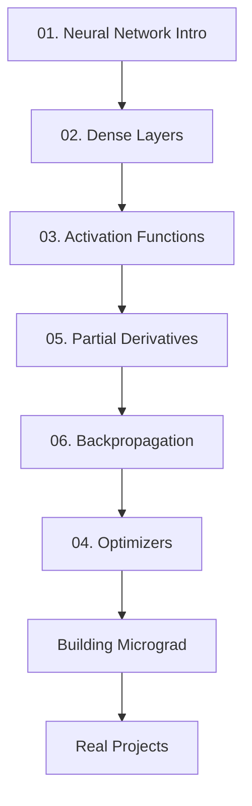

# 🧠 Neural Networks from Scratch

<div align="center">


**The Ultimate Beginner's Guide to Understanding & Building Neural Networks**

[](https://numpy.org/)
[](https://www.python.org/)
[](LICENSE)

**[📚 Start Learning](#-why-this-is-the-best-resource) • [🚀 Quick Start](#-quick-start) • [📖 Content](#-complete-learning-path) • [💡 Projects](#-hands-on-projects)**

</div>

---

## 🎯 What Makes This THE BEST Resource?

### ✨ For Pure Beginners

This isn't just another neural network tutorial. Here's why this is **THE definitive resource** for learning neural networks from scratch:

#### 🔥 **1. Zero to Hero Approach**
- 📌 **No Prerequisites**: Start with basic math, end with deep learning
- 🧮 **Math Made Simple**: Every equation explained in plain English
- 💻 **Code from Scratch**: Build everything using only NumPy (no black boxes!)
- 🎓 **Learn by Doing**: Hands-on Jupyter notebooks for every concept

#### 🎯 **2. Complete Learning System**
```
📖 Theory → 🧮 Math → 💻 Code → 🧪 Practice → 🚀 Projects
```

#### 🌟 **3. What You Get**
- ✅ **15 Comprehensive Modules** covering everything from neurons to CNNs
- ✅ **Interactive Jupyter Notebooks** with live code examples
- ✅ **Visual Explanations** with diagrams and animations
- ✅ **Real Implementation** - build actual working neural networks
- ✅ **10+ Reference Books** curated for deep learning
- ✅ **Cheat Sheets** for quick reference
- ✅ **Research Papers** to understand the foundations
- ✅ **Micrograd Tutorial** by Andrej Karpathy included

#### 💎 **4. Why "From Scratch" Matters**

| 🚫 Using Libraries Only | ✅ Building from Scratch |
|-------------------------|--------------------------|
| Black box understanding | Crystal clear intuition |
| Copy-paste coding | Deep comprehension |
| Stuck when things break | Debug like a pro |
| Surface-level knowledge | Master-level expertise |

#### 🎓 **5. Perfect for**
- 🎯 **Complete Beginners** wanting to understand AI/ML
- 💻 **Developers** transitioning to machine learning
- 🎓 **Students** preparing for AI/ML courses or interviews
- 🔬 **Researchers** needing solid fundamentals
- 🧠 **Curious Minds** who want to know how AI really works

---

## 🚀 Quick Start

### 📋 Prerequisites
```bash
# Just Python and NumPy!
pip install numpy jupyter matplotlib
```

### 🏃 Get Started in 3 Steps

```bash
# 1. Clone this repository
git clone <your-repo-url>
cd "Neural Networks"

# 2. Start with the basics
jupyter notebook "01.Neural Network Introduction/Intro.md"

# 3. Follow the learning path below!
```

---

## 📚 Complete Learning Path

### 🌱 **Phase 1: Foundations** (Start Here!)

#### 📘 [01. Neural Network Introduction](./01.Neural%20Network%20Introduction/)
**What you'll learn:**
- 🧠 What is a neural network?
- 🔢 The fundamental formula: `x₁w₁ + x₂w₂ + b`
- ⚡ Why activation functions matter
- 🎯 Your first neuron from scratch

**Files:**
- 📄 `Intro.md` - Conceptual foundation
- 📓 `NeuralNetworks_Coding_From_Scratch_Part1.ipynb` - Hands-on coding

---

#### 🏗️ [02. Coding a Dense Layer](./02.Coding%20a%20dense%20layer/)
**What you'll learn:**
- 🔗 How neurons connect in layers
- 🧮 Matrix operations for efficiency
- 💻 Building your first dense layer
- 📊 Forward propagation implementation

**Files:**
- 📓 `Dense_layer.ipynb` - Complete implementation

---

#### ⚡ [03. Activation Functions](./03.Activation%20Layer/)
**What you'll learn:**
- 🟢 **Sigmoid** - For probabilities (0 to 1)
- 🔵 **Tanh** - Zero-centered outputs (-1 to 1)
- 🔥 **ReLU** - The modern default (fast & effective)
- ⚡ **Leaky ReLU** - Fixing dying neurons
- 🔢 **Softmax** - Multi-class classification

**Files:**
- 📄 `Explanation_of_activation_layers.md` - Theory & use cases
- 📓 `activation_functions.ipynb` - All activations coded from scratch

**Visual Guide:**
| Function | Range | Best For |
|----------|-------|----------|
| Sigmoid | (0, 1) | Binary classification output |
| Tanh | (-1, 1) | Hidden layers (older networks) |
| ReLU | [0, ∞) | Hidden layers (default choice) |
| Softmax | (0, 1) sum=1 | Multi-class output |

---

### 🔥 **Phase 2: Training Neural Networks**

#### 🎯 [04. Optimizers](./04.Optimisers/)
**What you'll learn:**
- 📉 Gradient Descent basics
- 🎲 Stochastic Gradient Descent (SGD)
- 🏃 Momentum - Accelerated learning
- 📊 RMSProp - Adaptive learning rates
- ⚡ Adam - The industry standard

**Files:**
- 📄 `explantion.md` - How optimizers work

---

#### 🧮 [05. Partial Derivatives](./05.Partial_Derivatives/)
**What you'll learn:**
- 📐 Calculus for neural networks
- 🔗 Chain rule explained simply
- 📊 Computing gradients
- 🎯 Why derivatives matter for learning

**Files:**
- 📄 `partial_derivatives_explantion.md` - Math foundations
- 📄 `gradient_derivative.md` - Gradient computation

---

#### 🔄 [06. Backpropagation](./06.BackPropogation/) ⭐ **CRITICAL**
**What you'll learn:**
- 🧠 **The backbone of neural networks**
- 🔄 How networks learn from mistakes
- 🧮 Computing gradients efficiently
- 💻 Full implementation from scratch
- 🎯 Training on real data (spiral dataset)

**Files:**
- 📄 `Backpropogation_explanation.md` - Complete theory
- 📄 `backpropogation_manual_calculation.md` - Step-by-step math
- 📄 `single_neural_layer_code_from_scratch.md` - Minimal implementation
- 📓 `backpropogation.ipynb` - Interactive tutorial
- 📓 `Spiral_data_backpropogation.ipynb` - Real-world example

**Why This is Essential:**
> Without backpropagation, neural networks cannot learn. This is the most important algorithm in deep learning!

---

### 🚀 **Phase 3: Advanced Topics**

#### 🎨 [Building Micrograd](./Building_Micrograd_Andrej_Karpathy/)
**What you'll learn:**
- 🔧 Build an autograd engine from scratch
- 🧠 Understand PyTorch internals
- 🎓 Learn from Andrej Karpathy's legendary tutorial

**Files:**
- 📓 `01.Intro.ipynb` - Autograd implementation

---

## 📖 Learning Resources Included

### 📚 Books (11 Premium Resources)
Located in [`Book_for_Deep_Learning/`](./Book_for_Deep_Learning/)

- 📕 **Neural Networks and Deep Learning** - Michael Nielsen
- 📗 **Deep Learning From Scratch** - Practical implementation
- 📘 **Fundamentals of Deep Learning** - Comprehensive guide
- 📙 **Applied Deep Learning** - Real-world applications
- 📓 **Deep Learning with Python** - François Chollet
- 📔 **Programming PyTorch** - Framework mastery
- 📖 **Generative Deep Learning** - Creative AI
- 📚 **NN from Scratch (Reference Book)** - Your main companion
- 📝 **Deep Learning Course Notes** - Condensed wisdom
- 📋 **DL Notes** - Quick reference

### 📊 Cheat Sheets (10 Essential Guides)
Located in [`Cheat_Sheet/`](./Cheat_Sheet/)

- 🧠 Convolutional Neural Networks
- 🔄 Recurrent Neural Networks
- 🤖 Transformers & Large Language Models
- 💡 Deep Learning Tips & Tricks
- 🎯 Reflex Models
- 📊 States Models
- 🔢 Variables Models
- 🧮 Logic Models
- 🌟 Super Cheatsheet: Deep Learning
- 🚀 Super Cheatsheet: Artificial Intelligence

### 📄 Research Papers
Located in [`Research_paper_Deep_Learning/`](./Research_paper_Deep_Learning/)

Foundational papers that shaped modern AI

---

## 🎓 Learning Roadmap

### 🗺️ Recommended Path



### ⏱️ Time Commitment

| Phase | Topics | Estimated Time |
|-------|--------|----------------|
| 🌱 Foundations | 01-03 | 1-2 weeks |
| 🔥 Training | 04-06 | 2-3 weeks |
| 🚀 Advanced | Micrograd + Projects | 2-4 weeks |

**Total: 5-9 weeks** to master neural networks from scratch!

---

## 💡 Hands-on Projects

### 🎯 What You'll Build

1. **🔢 Single Neuron** - Understand the basics
2. **🏗️ Dense Neural Network** - Multi-layer architecture
3. **🌀 Spiral Dataset Classifier** - Non-linear decision boundaries
4. **✍️ MNIST Digit Recognition** - Classic computer vision
5. **🤖 Autograd Engine** - Build your own PyTorch

---

## 🛠️ Repository Structure

```
📦 Neural Networks from Scratch
├── 📁 01.Neural Network Introduction/
│   ├── 📄 Intro.md
│   └── 📓 NeuralNetworks_Coding_From_Scratch_Part1.ipynb
├── 📁 02.Coding a dense layer/
│   └── 📓 Dense_layer.ipynb
├── 📁 03.Activation Layer/
│   ├── 📄 Explanation_of_activation_layers.md
│   └── 📓 activation_functions.ipynb
├── 📁 04.Optimisers/
│   └── 📄 explantion.md
├── 📁 05.Partial_Derivatives/
│   ├── 📄 partial_derivatives_explantion.md
│   └── 📄 gradient_derivative.md
├── 📁 06.BackPropogation/
│   ├── 📄 Backpropogation_explanation.md
│   ├── 📄 backpropogation_manual_calculation.md
│   ├── 📄 single_neural_layer_code_from_scratch.md
│   ├── 📓 backpropogation.ipynb
│   └── 📓 Spiral_data_backpropogation.ipynb
├── 📁 Building_Micrograd_Andrej_Karpathy/
│   └── 📓 01.Intro.ipynb
├── 📁 Book_for_Deep_Learning/
│   └── 📚 11 Premium Books
├── 📁 Cheat_Sheet/
│   └── 📊 10 Essential Cheat Sheets
├── 📁 Research_paper_Deep_Learning/
│   └── 📄 Foundational Papers
├── 📁 Images/
│   └── 🖼️ Visual Resources
└── 📄 README.md (You are here!)
```

---

## 🎯 Learning Outcomes

### After Completing This Course, You Will:

✅ **Understand** how neural networks work at a fundamental level  
✅ **Implement** neural networks from scratch using only NumPy  
✅ **Explain** backpropagation, gradient descent, and optimization  
✅ **Debug** neural network training issues  
✅ **Build** real-world machine learning applications  
✅ **Read** and understand research papers  
✅ **Transition** easily to frameworks like PyTorch and TensorFlow  
✅ **Interview** confidently for ML/AI positions  

---

## 🌟 Key Concepts Covered

### 🧠 Core Concepts
- ✅ Neurons & Perceptrons
- ✅ Forward Propagation
- ✅ Activation Functions (Sigmoid, ReLU, Softmax, etc.)
- ✅ Loss Functions (MSE, Cross-Entropy)
- ✅ Backpropagation (The Backbone!)
- ✅ Gradient Descent & Optimization
- ✅ Matrix Operations for Neural Networks

### 🔥 Advanced Topics
- ✅ Momentum & Adaptive Learning Rates
- ✅ Regularization Techniques
- ✅ Batch Normalization
- ✅ Dropout
- ✅ Autograd Engines
- ✅ Deep Network Architectures

---

## 📈 Your Learning Journey

### 🎯 Week-by-Week Plan

#### **Week 1-2: Foundations** 🌱
- [ ] Read Neural Network Introduction
- [ ] Code your first neuron
- [ ] Build a dense layer
- [ ] Implement all activation functions
- [ ] **Milestone**: Understand forward propagation

#### **Week 3-4: The Math** 🧮
- [ ] Master partial derivatives
- [ ] Understand the chain rule
- [ ] Learn gradient computation
- [ ] **Milestone**: Comfortable with calculus for ML

#### **Week 5-6: Backpropagation** 🔥
- [ ] Study backpropagation theory
- [ ] Manual calculations
- [ ] Code backprop from scratch
- [ ] Train on spiral dataset
- [ ] **Milestone**: Build a fully functional neural network

#### **Week 7-8: Optimization** ⚡
- [ ] Implement SGD, Momentum, Adam
- [ ] Compare optimizer performance
- [ ] **Milestone**: Understand training dynamics

#### **Week 9+: Advanced** 🚀
- [ ] Build Micrograd
- [ ] Work on real projects
- [ ] Read research papers
- [ ] **Milestone**: Master-level understanding

---

## 🎓 Study Tips

### 💡 How to Use This Resource

1. **📖 Read First**: Start with the markdown explanations
2. **🧮 Understand Math**: Don't skip the equations - they're explained simply
3. **💻 Code Along**: Type the code yourself, don't just read
4. **🔄 Experiment**: Change parameters, break things, fix them
5. **📝 Take Notes**: Write down insights in your own words
6. **🎯 Build Projects**: Apply concepts to real problems
7. **🔁 Review**: Revisit earlier topics as you progress

### ⚠️ Common Pitfalls to Avoid

❌ Rushing through theory to get to code  
❌ Copy-pasting without understanding  
❌ Skipping the math sections  
❌ Not experimenting with the code  
❌ Moving forward without mastering basics  

✅ Take your time with each concept  
✅ Type every line of code yourself  
✅ Work through the math step-by-step  
✅ Modify and experiment constantly  
✅ Build solid foundations before advancing  

---

## 🤝 Contributing

Found a bug? Have a suggestion? Want to add content?

1. 🍴 Fork the repository
2. 🌿 Create a feature branch
3. ✍️ Make your changes
4. 📤 Submit a pull request

---

## 📞 Support & Community

- 💬 **Questions?** Open an issue
- 🐛 **Found a bug?** Report it
- 💡 **Have an idea?** Share it
- ⭐ **Like this?** Star the repo!

---

## 📜 License

This project is licensed under the MIT License - see the LICENSE file for details.

---

## 🙏 Acknowledgments

### 📚 Inspired By
- 🎓 **Andrew Ng** - Deep Learning Specialization
- 🧠 **Andrej Karpathy** - Neural Networks: Zero to Hero
- 📖 **Michael Nielsen** - Neural Networks and Deep Learning
- 🔬 **Ian Goodfellow** - Deep Learning Book

### 🌟 Special Thanks
- The open-source community
- All the researchers who made their papers accessible
- Everyone contributing to democratizing AI education

---

## 🚀 Ready to Start?

### Your Journey Begins Here! 👇

```bash
# Start with the basics
cd "01.Neural Network Introduction"
jupyter notebook Intro.md
```

### 🎯 Remember:
> "The best way to learn neural networks is to build them from scratch."

### 💪 You've Got This!

Building neural networks from scratch might seem daunting, but you're in the right place. This resource has helped countless beginners become confident ML practitioners. You're next!

---

<div align="center">

### ⭐ If this helps you, please star the repository! ⭐

**Happy Learning! 🚀🧠**

Made with ❤️ for aspiring AI engineers

[⬆ Back to Top](#-neural-networks-from-scratch)

</div>
