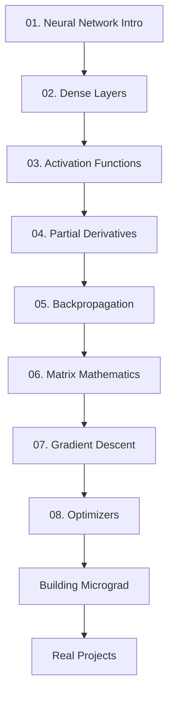

# 🧠 Zero to Neural Networks

<div align="center">


**The Ultimate Beginner's Guide to Understanding & Building Neural Networks from Scratch**

[](https://numpy.org/)
[](https://www.python.org/)
[](LICENSE)
[](https://github.com)

**[📚 Why This?](#-why-this-is-the-best-resource) • [🚀 Quick Start](#-quick-start) • [📖 Content](#-complete-learning-path) • [📑 Index](#-complete-content-index) • [💡 Projects](#-hands-on-projects)**

</div>

---

## 🎯 What Makes This THE BEST Resource?

### ✨ For Pure Beginners

This isn't just another neural network tutorial. Here's why this is **THE definitive resource** for learning neural networks from scratch:

#### 🔥 **1. Zero to Hero Approach**

- 📌 **No Prerequisites**: Start with basic math, end with deep learning
- 🧮 **Math Made Simple**: Every equation explained in plain English with proper LaTeX formatting
- 💻 **Code from Scratch**: Build everything using only NumPy (no black boxes!)
- 🎓 **Learn by Doing**: Hands-on Jupyter notebooks for every concept

#### 🎯 **2. Complete Learning System**

```
📖 Theory → 🧮 Math → 💻 Code → 🧪 Practice → 🚀 Projects
```

#### 🌟 **3. What You Get**

- ✅ **8 Comprehensive Modules** covering everything from neurons to optimizers
- ✅ **Interactive Jupyter Notebooks** with live code examples
- ✅ **Visual Explanations** with diagrams and animations
- ✅ **Real Implementation** - build actual working neural networks
- ✅ **11+ Reference Books** curated for deep learning
- ✅ **10+ Cheat Sheets** for quick reference
- ✅ **Research Papers** to understand the foundations
- ✅ **Micrograd Tutorial** by Andrej Karpathy included

#### 💎 **4. Why "From Scratch" Matters**

| 🚫 Using Libraries Only | ✅ Building from Scratch |
| ----------------------- | ------------------------ |
| Black box understanding | Crystal clear intuition  |
| Copy-paste coding       | Deep comprehension       |
| Stuck when things break | Debug like a pro         |
| Surface-level knowledge | Master-level expertise   |

#### 🎓 **5. Perfect for**

- 🎯 **Complete Beginners** wanting to understand AI/ML
- 💻 **Developers** transitioning to machine learning
- 🎓 **Students** preparing for AI/ML courses or interviews
- 🔬 **Researchers** needing solid fundamentals
- 🧠 **Curious Minds** who want to know how AI really works

---

## 🚀 Quick Start

### 📋 Prerequisites

```bash
# Just Python and NumPy!
pip install numpy jupyter matplotlib
```

### 🏃 Get Started in 3 Steps

```bash
# 1. Clone this repository
git clone <your-repo-url>
cd "Neural Networks"

# 2. Start with the basics
jupyter notebook "01.Neural Network Introduction/Intro.md"

# 3. Follow the learning path below!
```

---

## 📚 Complete Learning Path

### 🌱 **Phase 1: Foundations** (Start Here!)

#### 📘 [01. Neural Network Introduction](./01.Neural%20Network%20Introduction/)

**What you'll learn:**

- 🧠 What is a neural network?
- 🔢 The fundamental formula: `x₁w₁ + x₂w₂ + b`
- ⚡ Why activation functions matter
- 🎯 Your first neuron from scratch

**Files:**

- 📄 `Intro.md` - Conceptual foundation
- 📓 `NeuralNetworks_Coding_From_Scratch_Part1.ipynb` - Hands-on coding

---

#### 🏗️ [02. Coding a Dense Layer](./02.Coding%20a%20dense%20layer/)

**What you'll learn:**

- 🔗 How neurons connect in layers
- 🧮 Matrix operations for efficiency
- 💻 Building your first dense layer
- 📊 Forward propagation implementation

**Files:**

- 📓 `Dense_layer.ipynb` - Complete implementation

---

#### ⚡ [03. Activation Functions](./03.Activation%20Layer/)

**What you'll learn:**

- 🟢 **Sigmoid** - For probabilities (0 to 1)
- 🔵 **Tanh** - Zero-centered outputs (-1 to 1)
- 🔥 **ReLU** - The modern default (fast & effective)
- ⚡ **Leaky ReLU** - Fixing dying neurons
- 🔢 **Softmax** - Multi-class classification

**Files:**

- 📄 `Explanation_of_activation_layers.md` - Theory & use cases
- 📓 `activation_functions.ipynb` - All activations coded from scratch

**Visual Guide:**
| Function | Range | Best For |
|----------|-------|----------|
| Sigmoid | (0, 1) | Binary classification output |
| Tanh | (-1, 1) | Hidden layers (older networks) |
| ReLU | [0, ∞) | Hidden layers (default choice) |
| Softmax | (0, 1) sum=1 | Multi-class output |

---

### 🔥 **Phase 2: Training Neural Networks**

#### 🧮 [04. Partial Derivatives](./04.Partial_Derivatives/)

**What you'll learn:**

- 📐 Calculus for neural networks
- 🔗 Chain rule explained simply
- 📊 Computing gradients
- 🎯 Why derivatives matter for learning

**Files:**

- 📄 `partial_derivatives_explantion.md` - Math foundations
- 📄 `gradient_derivative.md` - Gradient computation

---

#### 🔄 [05. Backpropagation](./05.BackPropogation/) ⭐ **CRITICAL**

**What you'll learn:**

- 🧠 **The backbone of neural networks**
- 🔄 How networks learn from mistakes
- 🧮 Computing gradients efficiently
- 💻 Full implementation from scratch
- 🎯 Training on real data (spiral dataset)
- 🔥 Cross-entropy loss implementation

**Files:**

- 📄 `01.Backpropogation_explanation.md` - Complete theory
- 📄 `02.backpropogation_manual_calculation.md` - Step-by-step math
- 📓 `03.backpropogation.ipynb` - Interactive tutorial
- 📓 `04.Spiral_data_backpropogation.ipynb` - Real-world example
- 📁 `Implemention_backpropogation_crossentropyloss/` - Advanced implementation
  - 📄 `01.Implemention_backpropogation_crossentropyloss.md` - Theory
  - 📓 `code.ipynb` - Complete code

**Why This is Essential:**

> Without backpropagation, neural networks cannot learn. This is the most important algorithm in deep learning!

---

#### 🎯 [06. Why Matrices Matter in Backpropagation](./06.Why_matrices_imp_for_backpropogation/)

**What you'll learn:**

- 🔢 Why we use matrix operations in neural networks
- 🧮 How input transpose appears in gradient computation
- 📊 Shape reasoning for weight gradients
- 💻 Matrix-based backpropagation implementation
- 🎯 Forward and backward pass with matrices

**Files:**

- 📄 `explanation.md` - Complete matrix mathematics
- 📓 `manual_cal_coding.ipynb` - Manual calculations with code

**Key Insight:**

> Forward pass distributes input through weights; backward pass distributes error through transposed weights.

---

#### 📉 [07. Gradient Descent](./07.Gradient_Desent/)

**What you'll learn:**

- 📉 Batch Gradient Descent
- 🎲 Stochastic Gradient Descent (SGD)
- 📊 Mini-batch Gradient Descent
- ⚡ When to use each variant

**Files:**

- 📄 `Types_of_GD.md` - Explanation with code examples

---

#### 🚀 [08. Optimizers](./08.Optimisers/)

**What you'll learn:**

- 📉 Gradient Descent basics
- 🏃 **Momentum** - Accelerated learning with velocity
- 📊 **Adagrad** - Adaptive learning rates per parameter
- 🔥 **RMSProp** - Root Mean Square Propagation
- ⚡ **Adam** - The industry standard (Adaptive Moment Estimation)

**Files:**

- 📄 `explantion.md` - Overview of all optimizers
- 📁 `1.Momentum/` - Momentum optimizer
  - 📄 `explanation.md` - Theory
  - 📓 `code.ipynb` - Implementation
- 📁 `2.Adagrad/` - Adagrad optimizer
  - 📄 `explanation.md` - Complete guide
- 📁 `3.Rmsprop/` - RMSProp optimizer
  - 📄 `explanation.md` - Detailed explanation
- 📁 `4.Adam_Optimiser/` - Adam optimizer
  - 📄 `explanation.md` - Industry standard guide

**Optimizer Comparison:**
| Optimizer | Learning Rate | Best For |
|-----------|---------------|----------|
| SGD | Fixed | Simple problems |
| Momentum | Fixed + velocity | Escaping local minima |
| Adagrad | Adaptive per parameter | Sparse data |
| RMSProp | Adaptive with decay | RNNs, non-stationary |
| Adam | Adaptive + momentum | Default choice (most cases) |

---

### 🚀 **Phase 3: Advanced Topics & Bonus Content**

#### 🎁 [Bonus Resources](./Bonus/)

A comprehensive collection of premium learning materials to deepen your understanding.

##### 📚 [Books for Deep Learning](./Bonus/Book_for_Deep_Learning/)

11 carefully curated books covering theory to practice:

- 📕 **Neural Networks and Deep Learning** - Michael Nielsen
- 📗 **Deep Learning From Scratch** - Practical implementation
- 📘 **Fundamentals of Deep Learning** - Comprehensive guide
- 📙 **Applied Deep Learning** - Real-world applications
- 📓 **Deep Learning with Python** - François Chollet
- 📔 **Programming PyTorch** - Framework mastery
- 📖 **Generative Deep Learning** - Creative AI
- 📚 **NN from Scratch (Reference Book)** - Your main companion
- 📝 **Deep Learning Course Notes** - Condensed wisdom
- 📋 **DL Notes** - Quick reference

##### 📊 [Cheat Sheets](./Bonus/Cheat_Sheet/)

10 essential quick-reference guides:

- 🧠 Convolutional Neural Networks
- 🔄 Recurrent Neural Networks
- 🤖 Transformers & Large Language Models
- 💡 Deep Learning Tips & Tricks
- 🎯 Reflex Models
- 📊 States Models
- 🔢 Variables Models
- 🧮 Logic Models
- 🌟 Super Cheatsheet: Deep Learning
- 🚀 Super Cheatsheet: Artificial Intelligence

##### 🎨 [Building Micrograd](./Bonus/Building_Micrograd_Andrej_Karpathy/)

**What you'll learn:**

- 🔧 Build an autograd engine from scratch
- 🧠 Understand PyTorch internals
- 🎓 Learn from Andrej Karpathy's legendary tutorial

**Files:**

- 📓 `01.Intro.ipynb` - Autograd implementation

##### 📄 [Research Papers](./Bonus/Research_paper_Deep_Learning/)

Foundational papers that shaped modern AI

---

## 📖 Learning Resources Included

All premium resources are now organized in the [`Bonus/`](./Bonus/) folder for easy access!

### 📚 Books (11 Premium Resources)

Located in [`Bonus/Book_for_Deep_Learning/`](./Bonus/Book_for_Deep_Learning/)

- 📕 **Neural Networks and Deep Learning** - Michael Nielsen
- 📗 **Deep Learning From Scratch** - Practical implementation
- 📘 **Fundamentals of Deep Learning** - Comprehensive guide
- 📙 **Applied Deep Learning** - Real-world applications
- 📓 **Deep Learning with Python** - François Chollet
- 📔 **Programming PyTorch** - Framework mastery
- 📖 **Generative Deep Learning** - Creative AI
- 📚 **NN from Scratch (Reference Book)** - Your main companion
- 📝 **Deep Learning Course Notes** - Condensed wisdom
- 📋 **DL Notes** - Quick reference

### 📊 Cheat Sheets (10 Essential Guides)

Located in [`Bonus/Cheat_Sheet/`](./Bonus/Cheat_Sheet/)

- 🧠 Convolutional Neural Networks
- 🔄 Recurrent Neural Networks
- 🤖 Transformers & Large Language Models
- 💡 Deep Learning Tips & Tricks
- 🎯 Reflex Models
- 📊 States Models
- 🔢 Variables Models
- 🧮 Logic Models
- 🌟 Super Cheatsheet: Deep Learning
- 🚀 Super Cheatsheet: Artificial Intelligence

### 📄 Research Papers

Located in [`Bonus/Research_paper_Deep_Learning/`](./Bonus/Research_paper_Deep_Learning/)

Foundational papers that shaped modern AI

---

## 🎓 Learning Roadmap

### 🗺️ Recommended Path



### ⏱️ Time Commitment

| Phase          | Topics               | Estimated Time |
| -------------- | -------------------- | -------------- |
| 🌱 Foundations | 01-03                | 1-2 weeks      |
| 🔥 Training    | 04-08                | 3-4 weeks      |
| 🚀 Advanced    | Micrograd + Projects | 2-4 weeks      |

**Total: 6-10 weeks** to master neural networks from scratch!

---

## 💡 Hands-on Projects

### 🎯 What You'll Build

1. **🔢 Single Neuron** - Understand the basics
2. **🏗️ Dense Neural Network** - Multi-layer architecture
3. **🌀 Spiral Dataset Classifier** - Non-linear decision boundaries
4. **✍️ MNIST Digit Recognition** - Classic computer vision
5. **🤖 Autograd Engine** - Build your own PyTorch

---

## 📑 Complete Content Index

### 📂 Core Modules (8 Chapters)

<details>
<summary><b>📘 01. Neural Network Introduction</b> - Foundation Concepts</summary>

- `Intro.md` - What is a neural network?
- `NeuralNetworks_Coding_From_Scratch_Part1.ipynb` - First neuron implementation
- **Key Topics**: Neurons, weights, biases, basic formula

</details>

<details>
<summary><b>🏗️ 02. Coding a Dense Layer</b> - Building Blocks</summary>

- `Dense_layer.ipynb` - Complete dense layer from scratch
- **Key Topics**: Matrix operations, layer connections, forward pass

</details>

<details>
<summary><b>⚡ 03. Activation Functions</b> - Non-linearity</summary>

- `Explanation_of_activation_layers.md` - Theory and use cases
- `activation_functions.ipynb` - All activations coded
- **Key Topics**: Sigmoid, Tanh, ReLU, Leaky ReLU, Softmax

</details>

<details>
<summary><b>🧮 04. Partial Derivatives</b> - Calculus Foundations</summary>

- `partial_derivatives_explantion.md` - Math foundations
- `gradient_derivative.md` - Gradient computation
- **Key Topics**: Chain rule, derivatives, gradient computation

</details>

<details>
<summary><b>🔄 05. Backpropagation</b> - The Learning Algorithm ⭐</summary>

- `01.Backpropogation_explanation.md` - Complete theory
- `02.backpropogation_manual_calculation.md` - Step-by-step math
- `03.backpropogation.ipynb` - Interactive tutorial
- `04.Spiral_data_backpropogation.ipynb` - Real dataset
- `Implemention_backpropogation_crossentropyloss/`
  - `01.Implemention_backpropogation_crossentropyloss.md` - Advanced theory
  - `code.ipynb` - Full implementation
- **Key Topics**: Gradient flow, chain rule, weight updates, cross-entropy

</details>

<details>
<summary><b>🔢 06. Matrix Mathematics for Backpropagation</b> - Deep Understanding</summary>

- `explanation.md` - Why matrices matter
- `manual_cal_coding.ipynb` - Manual calculations
- **Key Topics**: Transpose operations, shape reasoning, efficient computation

</details>

<details>
<summary><b>📉 07. Gradient Descent</b> - Optimization Basics</summary>

- `Types_of_GD.md` - All gradient descent variants
- **Key Topics**: Batch GD, Stochastic GD, Mini-batch GD

</details>

<details>
<summary><b>🚀 08. Optimizers</b> - Advanced Training</summary>

- `explantion.md` - Overview of all optimizers
- `1.Momentum/`
  - `explanation.md` - Momentum theory
  - `code.ipynb` - Implementation
- `2.Adagrad/`
  - `explanation.md` - Adaptive learning rates
- `3.Rmsprop/`
  - `explanation.md` - RMSProp explained
- `4.Adam_Optimiser/`
  - `explanation.md` - Industry standard
- **Key Topics**: SGD, Momentum, Adagrad, RMSProp, Adam

</details>

---

### 🎁 Bonus Content

<details>
<summary><b>📚 Books for Deep Learning (11 Premium Books)</b></summary>

1. Neural Networks and Deep Learning - Michael Nielsen
2. Deep Learning From Scratch
3. Fundamentals of Deep Learning
4. Applied Deep Learning
5. Deep Learning with Python - François Chollet
6. Programming PyTorch
7. Generative Deep Learning
8. NN from Scratch (Reference Book)
9. Deep Learning Course Notes
10. DL Notes
11. Additional reference materials

</details>

<details>
<summary><b>📊 Cheat Sheets (10 Essential Guides)</b></summary>

1. Convolutional Neural Networks
2. Recurrent Neural Networks
3. Transformers & Large Language Models
4. Deep Learning Tips & Tricks
5. Reflex Models
6. States Models
7. Variables Models
8. Logic Models
9. Super Cheatsheet: Deep Learning
10. Super Cheatsheet: Artificial Intelligence

</details>

<details>
<summary><b>🎨 Building Micrograd</b> - Andrej Karpathy's Tutorial</summary>

- `01.Intro.ipynb` - Build an autograd engine from scratch
- **Key Topics**: Automatic differentiation, computational graphs, PyTorch internals

</details>

<details>
<summary><b>📄 Research Papers</b> - Foundational AI Papers</summary>

- Collection of seminal papers in deep learning
- **Topics**: Neural network architectures, training techniques, optimization

</details>

---

## 🏗️ Neural Network Architecture Overview

### 📐 What You'll Build

```
┌─────────────────────────────────────────────────────────────┐
│                    NEURAL NETWORK PIPELINE                   │
└─────────────────────────────────────────────────────────────┘

📥 INPUT LAYER
   ↓
   [x₁, x₂, ..., xₙ]
   ↓
🧱 DENSE LAYER 1 (Hidden)
   ↓
   Z₁ = X·W₁ + b₁
   ↓
⚡ ACTIVATION (ReLU/Sigmoid/Tanh)
   ↓
   A₁ = activation(Z₁)
   ↓
🧱 DENSE LAYER 2 (Hidden)
   ↓
   Z₂ = A₁·W₂ + b₂
   ↓
⚡ ACTIVATION (ReLU)
   ↓
   A₂ = activation(Z₂)
   ↓
🧱 OUTPUT LAYER
   ↓
   Z₃ = A₂·W₃ + b₃
   ↓
⚡ SOFTMAX (Classification) / LINEAR (Regression)
   ↓
   ŷ = softmax(Z₃)
   ↓
❌ LOSS FUNCTION
   ↓
   L = CrossEntropy(ŷ, y) or MSE(ŷ, y)
   ↓
🔄 BACKPROPAGATION
   ↓
   ∂L/∂W₃, ∂L/∂W₂, ∂L/∂W₁
   ↓
🚀 OPTIMIZER (SGD/Adam/RMSProp)
   ↓
   W = W - η·∇W
   ↓
🔁 REPEAT UNTIL CONVERGENCE
```

### 🎯 Key Components You'll Master

| Component                  | What It Does          | Where You Learn It |
| -------------------------- | --------------------- | ------------------ |
| 🧱 **Dense Layer**         | Connects neurons      | Module 02          |
| ⚡ **Activation**          | Adds non-linearity    | Module 03          |
| 📉 **Loss Function**       | Measures error        | Module 05          |
| 🔄 **Backpropagation**     | Computes gradients    | Module 05          |
| 🧮 **Partial Derivatives** | Calculus foundation   | Module 04          |
| 📊 **Gradient Descent**    | Updates weights       | Module 07          |
| 🚀 **Optimizers**          | Smart weight updates  | Module 08          |
| 🔢 **Matrix Operations**   | Efficient computation | Module 06          |

---

## 🎓 Learning Outcomes

### After Completing This Course, You Will:

✅ **Understand** how neural networks work at a fundamental level  
✅ **Implement** neural networks from scratch using only NumPy  
✅ **Explain** backpropagation, gradient descent, and optimization  
✅ **Debug** neural network training issues  
✅ **Build** real-world machine learning applications  
✅ **Read** and understand research papers  
✅ **Transition** easily to frameworks like PyTorch and TensorFlow  
✅ **Interview** confidently for ML/AI positions

### 🧠 Core Concepts Mastered

**Fundamentals:**

- ✅ Neurons & Perceptrons
- ✅ Forward Propagation
- ✅ Activation Functions (Sigmoid, ReLU, Softmax, etc.)
- ✅ Loss Functions (MSE, Cross-Entropy)
- ✅ Backpropagation Algorithm
- ✅ Gradient Descent & Variants
- ✅ Matrix Operations for Neural Networks

**Advanced Topics:**

- ✅ Momentum & Adaptive Learning Rates
- ✅ Optimizer Comparison (SGD, Adam, RMSProp, Adagrad)
- ✅ Batch vs Stochastic vs Mini-batch Training
- ✅ Autograd Engines
- ✅ Deep Network Architectures
- ✅ Training Dynamics & Convergence

---

## 🛠️ Repository Structure

```
📦 Neural Networks from Scratch
├── 📁 01.Neural Network Introduction/
│   ├── 📄 Intro.md
│   └── 📓 NeuralNetworks_Coding_From_Scratch_Part1.ipynb
├── 📁 02.Coding a dense layer/
│   └── 📓 Dense_layer.ipynb
├── 📁 03.Activation Layer/
│   ├── 📄 Explanation_of_activation_layers.md
│   └── 📓 activation_functions.ipynb
├── 📁 04.Partial_Derivatives/
│   ├── 📄 partial_derivatives_explantion.md
│   └── 📄 gradient_derivative.md
├── 📁 05.BackPropogation/
│   ├── 📄 01.Backpropogation_explanation.md
│   ├── 📄 02.backpropogation_manual_calculation.md
│   ├── 📓 03.backpropogation.ipynb
│   ├── 📓 04.Spiral_data_backpropogation.ipynb
│   └── 📁 Implemention_backpropogation_crossentropyloss/
│       ├── 📄 01.Implemention_backpropogation_crossentropyloss.md
│       └── 📓 code.ipynb
├── 📁 06.Why_matrices_imp_for_backpropogation/
│   ├── 📄 explanation.md
│   └── 📓 manual_cal_coding.ipynb
├── 📁 07.Gradient_Desent/
│   └── 📄 Types_of_GD.md
├── 📁 08.Optimisers/
│   ├── 📄 explantion.md
│   ├── 📁 1.Momentum/
│   │   ├── 📄 explanation.md
│   │   └── 📓 code.ipynb
│   ├── 📁 2.Adagrad/
│   │   └── 📄 explanation.md
│   ├── 📁 3.Rmsprop/
│   │   └── 📄 explanation.md
│   └── 📁 4.Adam_Optimiser/
│       └── 📄 explanation.md
├── 📁 Bonus/
│   ├── 📁 Book_for_Deep_Learning/
│   │   └── 📚 11 Premium Books
│   ├── 📁 Cheat_Sheet/
│   │   └── 📊 10 Essential Cheat Sheets
│   ├── 📁 Building_Micrograd_Andrej_Karpathy/
│   │   └── 📓 01.Intro.ipynb
│   └── 📁 Research_paper_Deep_Learning/
│       └── 📄 Foundational Papers
├── 📁 Images/
│   └── 🖼️ Visual Resources
└── 📄 README.md (You are here!)
```

---

## 📈 Your Learning Journey

### 🎯 Week-by-Week Plan

#### **Week 1-2: Foundations** 🌱

- [ ] Read Neural Network Introduction
- [ ] Code your first neuron
- [ ] Build a dense layer
- [ ] Implement all activation functions
- [ ] **Milestone**: Understand forward propagation

#### **Week 3-4: The Math** 🧮

- [ ] Master partial derivatives
- [ ] Understand the chain rule
- [ ] Learn gradient computation
- [ ] **Milestone**: Comfortable with calculus for ML

#### **Week 5-6: Backpropagation** 🔥

- [ ] Study backpropagation theory
- [ ] Manual calculations
- [ ] Code backprop from scratch
- [ ] Understand matrix operations in backprop
- [ ] Train on spiral dataset
- [ ] **Milestone**: Build a fully functional neural network

#### **Week 7-8: Optimization** ⚡

- [ ] Learn gradient descent variants
- [ ] Implement SGD, Momentum, Adam
- [ ] Compare optimizer performance
- [ ] **Milestone**: Understand training dynamics

#### **Week 9+: Advanced** 🚀

- [ ] Build Micrograd
- [ ] Work on real projects
- [ ] Read research papers
- [ ] **Milestone**: Master-level understanding

---

## 🎓 Study Tips

### 💡 How to Use This Resource

1. **📖 Read First**: Start with the markdown explanations
2. **🧮 Understand Math**: Don't skip the equations - they're explained simply
3. **💻 Code Along**: Type the code yourself, don't just read
4. **🔄 Experiment**: Change parameters, break things, fix them
5. **📝 Take Notes**: Write down insights in your own words
6. **🎯 Build Projects**: Apply concepts to real problems
7. **🔁 Review**: Revisit earlier topics as you progress

### ⚠️ Common Pitfalls to Avoid

❌ Rushing through theory to get to code  
❌ Copy-pasting without understanding  
❌ Skipping the math sections  
❌ Not experimenting with the code  
❌ Moving forward without mastering basics

✅ Take your time with each concept  
✅ Type every line of code yourself  
✅ Work through the math step-by-step  
✅ Modify and experiment constantly  
✅ Build solid foundations before advancing

---

## 🤝 Contributing

Found a bug? Have a suggestion? Want to add content?

1. 🍴 Fork the repository
2. 🌿 Create a feature branch
3. ✍️ Make your changes
4. 📤 Submit a pull request

---

## 📞 Support & Community

- 💬 **Questions?** Open an issue
- 🐛 **Found a bug?** Report it
- 💡 **Have an idea?** Share it
- ⭐ **Like this?** Star the repo!

---

## 📜 License

This project is licensed under the MIT License - see the LICENSE file for details.

---

## 🙏 Acknowledgments

### 📚 Inspired By

- 🎓 **Andrew Ng** - Deep Learning Specialization
- 🧠 **Andrej Karpathy** - Neural Networks: Zero to Hero
- 📖 **Michael Nielsen** - Neural Networks and Deep Learning
- 🔬 **Ian Goodfellow** - Deep Learning Book

### 🌟 Special Thanks

- The open-source community
- All the researchers who made their papers accessible
- Everyone contributing to democratizing AI education

---

## 🚀 Ready to Start?

### Your Journey Begins Here! 👇

```bash
# Start with the basics
cd "01.Neural Network Introduction"
jupyter notebook Intro.md
```

### 🎯 Remember:

> "The best way to learn neural networks is to build them from scratch."

### 💪 You've Got This!

Building neural networks from scratch might seem daunting, but you're in the right place. This resource has helped countless beginners become confident ML practitioners. You're next!

---

<div align="center">

### ⭐ If this helps you, please star the repository! ⭐

**Happy Learning! 🚀🧠**

Made with ❤️ for aspiring AI engineers

[⬆ Back to Top](#-neural-networks-from-scratch)

</div>
